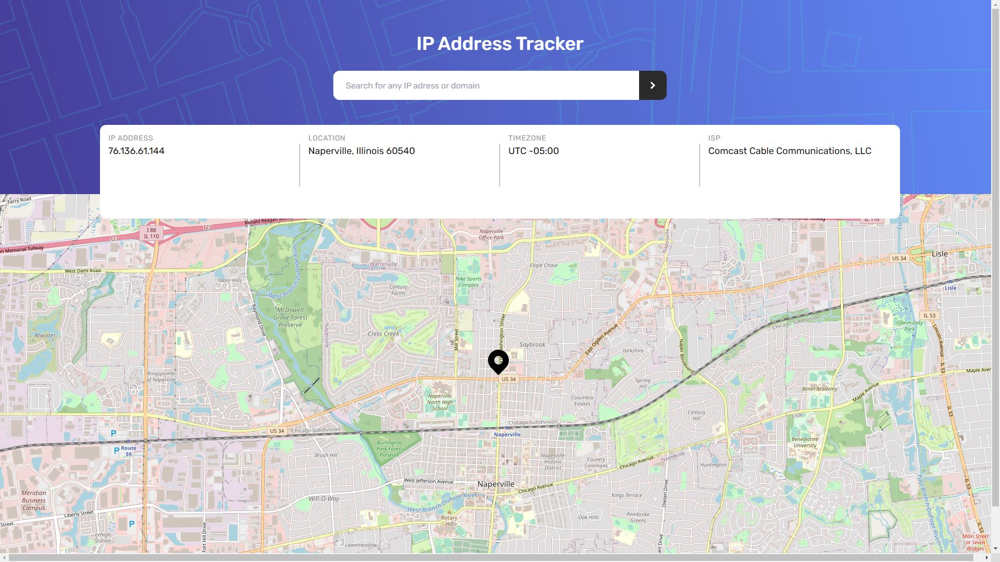

# Frontend Mentor - IP address tracker solution

This is a solution to the [IP address tracker challenge on Frontend Mentor](https://www.frontendmentor.io/challenges/ip-address-tracker-I8-0yYAH0). Frontend Mentor challenges help you improve your coding skills by building realistic projects. 

## Table of contents

- [Overview](#overview)
  - [The challenge](#the-challenge)
  - [Screenshot](#screenshot)
  - [Links](#links)
- [My process](#my-process)
  - [Built with](#built-with)
  - [What I learned](#what-i-learned)
- [Author](#author)

## Overview

### The challenge

Users are able to:

- View the optimal layout for each page depending on their device's screen size
- See hover states for all interactive elements on the page
- See their own IP address on the map on the initial page load
- Search for any IP addresses or domains and see the key information and location

### Screenshot



### Links

-[Live site](https://helsel-ip-tracker.netlify.app/)

## My process

### Built with

- Semantic HTML5 markup
- [TailwindCSS](https://tailwindcss.com/)
- Flexbox
- [Leaflet API](https://leafletjs.com/)
- [Ipify Gelocation API and IP API](https://www.ipify.org/)

### What I learned

This was an exercise in using a new sort of API, and one that has far more features than I need for the scope of this project. Leafletjs is very cool and I fully intend to play with it some more in the coming weeks. Being able to throw such a robust and customizeable map into my web projects has endless possibilities.

This was also my first time customizing which query paramaters are used for the API call based on the input. The user's input is compared to a RegExp expression to determain whether it's a domain or an IP address. I chose to go with a simple implementation here that doesn't check for valid IP address or domain formatting.

```js
//Check if input only contains numbers and dots
const IsIp = (input) => {
    const splitInput = input.split('');
    const pattern = new RegExp("[0-9.]");

    let isGood = true;

    splitInput.forEach((el) => {
        if(!pattern.test(el))
            isGood = false;
    });

    return isGood;
};
```

The API will return an error which is placed into the DOM if the IP or domain is invalid so I left this as is for now. Pruning out bad requests before making them could certainly cut down on unneeded API calls and is a future optimization to keep in mind.

### Continued development

Overall, I'm pretty happy with this project in it's current state. Some things I may change down the line are small optimizations, and using a different tileset for Leaflet that looks more like Google Maps. I'm not a huge fan of their default one.

## Author

- Website - [Jeremy Helsel](https://www.your-site.com)
- Frontend Mentor - [@JIH7](https://www.frontendmentor.io/profile/yourusername)
